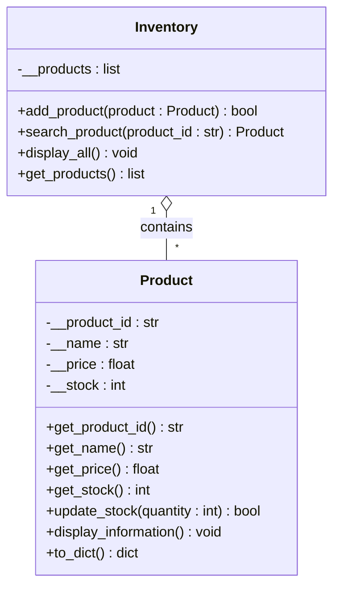

# UML Class Diagram

```mermaid
classDiagram
    class Product {
        -__product_id : str
        -__name : str
        -__price : float
        -__stock : int
        +get_product_id() str
        +get_name() str
        +get_price() float
        +get_stock() int
        +update_stock(quantity : int) bool
        +display_information() void
        +to_dict() dict
    }

    class Inventory {
        -__products : list
        +add_product(product : Product) bool
        +search_product(product_id : str) Product
        +display_all() void
        +get_products() list
    }

    Inventory "1" o-- "*" Product : contains
```

The main program (`inventory_manager.py`) is not a class: it shows the menu, reads user
input, calls `Inventory` methods, and handles loading/saving `inventory.json`.
